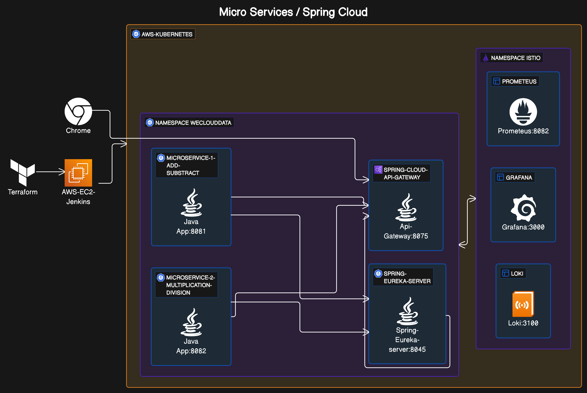

# Spring Boot Cloud Netflix on Kubernetes Architecture

This document outlines the architecture of a microservices-based system utilizing Spring Boot Cloud Netflix components, deployed on Kubernetes (K8S). The system is designed for high availability, scalability, and robust service discovery and monitoring.

## Architecture Overview

The system is structured into several components, each running within the AWS cloud environment and orchestrated by Kubernetes.

### Infrastructure Setup

- **Terraform**: Used for infrastructure as code to provision the AWS resources.
- **AWS EC2 Jenkins**: An AWS EC2 instance is set up to run Jenkins for continuous integration and delivery (CI/CD) pipelines.

### Kubernetes (K8S)

- **AWS-KUBERNETES**: The Kubernetes cluster hosted on AWS, used to manage and scale the microservices.

### Microservices

- **NAMESPACE WE-CLOUD-DATA**:
  - **MICROSERVICE-1**: A Spring Boot Java application responsible for addition and subtraction operations. It runs on port `8081`.
  - **MICROSERVICE-2**: Another Spring Boot Java application that handles multiplication and division operations, running on port `8082`.

### API Gateway

- **SPRING-CLOUD-API-GATEWAY**: Acts as the entry point for all the microservices. It is responsible for request routing, composition, and protocol translation. It is accessible on port `8075`.

### Service Discovery

- **SPRING-EUREKA-SERVER**: Provides service discovery to register and locate microservices within the ecosystem. It helps in load balancing and failover of services. The Eureka server is accessible on port `8045`.

### Monitoring and Observability

- **NAMESPACE ISTIO**:
  - **PROMETHEUS**: An open-source monitoring solution that collects and stores metrics as time series data. It is running on port `8082`.
  - **GRAFANA**: A multi-platform open-source analytics and interactive visualization web application. It provides charts, graphs, and alerts for the web when connected to supported data sources, running on port `3000`.
  - **LOKI**: A horizontally-scalable, highly-available, multi-tenant log aggregation system inspired by Prometheus. It is accessible on port `3100`.

### User Interaction

- **Chrome**: The user interacts with the system through a browser, likely Chrome, sending requests to the Spring Cloud API Gateway.

## Workflow

1. The user sends a request via Chrome to the Spring Cloud API Gateway.
2. The API Gateway forwards the request to the appropriate microservice in the WE-CLOUD-DATA namespace based on the request path.
3. The microservices perform their respective operations and send back the response through the API Gateway.
4. Jenkins automates the deployment of microservices, leveraging the infrastructure created by Terraform.
5. The Eureka server manages service discovery, while Prometheus, Grafana, and Loki provide monitoring and logging.

#### Summary
 - Each service is encapsulated within its own container and is part of a microservice architecture that facilitates scalability and ease of maintenance. The observability of the system is managed through Prometheus, Grafana, and Loki, allowing for efficient monitoring and analysis.

> [!CAUTION]
> You should use this scripts in production environment, you must read each script and try to have a deep understanding about these scripts. The permissions and AWS policies, GitHub Credentials, and Docker Hub are temporals.  

> [!NOTE]
> You should have Terraform in your PATH environment.

> [!NOTE]
>	You should work always in /tmp.
> You should have kubectl in your path
> You should have Python in your path with the versions between ( 3.10 and 3.12)

> [!NOTE]
>	All the commands must be run as ubuntu user or any local user ( default user) .

> [!NOTE]
> You should try to understand each folder in Final-Capstone-Project (https://github.com/maxiplux/Final-Capstone-Project-weclouddata.git).
## Instalation.
- Setup your K8S cluster.
- Setup local enviroment and AWS MACHINE.
- git clone https://github.com/maxiplux/Final-Capstone-Project-weclouddata.git
- 
- cd  /tmp/Final-Capstone-Project-weclouddata
- terraform init
- terraform apply  -auto-approve
- terraform output -raw iam_user_secret_access_key
- copy in a notepad the secret key and access key
- Now we are going to create an AWS machine
- cd  /tmp/Final-Capstone-Project-weclouddata/aws-jenkins-machine/terraform
- 
- Do Login in your AWS console and Go to your Jenkins Machine
- Go to the SSH AWS console and execute the command
- sh /tmp/is-running-jenkins.sh
- 
- 
- After this, return to your local console to see your terraform script end sucessfully.
- 
- After this you should be able to go to your jenkins server and setup the Spring Boot Netflix Java project.
- You should clone the project in https://github.com/maxiplux/k8s-istio-math.git and setup it in your Jenkins server.
- In addition you need to setup the enviroment variables DOCKER_PASSWORD & DOCKER_USERNAME with your docker hub credentials.
- 
- Now we need to setup our K8S cluster.
- As you can see we are seeing some errors in our pipelines because we need to setup K8S.
- 
- 

#Amazon Elastic Kubernetes Service (Amazon EKS)
## Setup AWS permissions
- Go to /tmp/Final-Capstone-Project-weclouddata/aws-eks-permissions
- Execute the following commands.
- terraform init
- terraform apply  -auto-approve
- terraform output -raw iam_user_secret_access_key
- With the secret key and access key, you should be able to create your K8S cluster in your EC2 Jenkins machine
- Execute the following commands in your EC2 Machine.
- 
- aws configure  # This is to setup your AWS credentials 
- aws ec2 describe-instances # This is to test your connection
## Create AWS K8S CLUSTER
- Clone the project https://github.com/maxiplux/project-7-jenkins-to-eks.git and then go to /tmp/Final-Capstone-Project-weclouddata/aws-eks-cluster
- cd /tmp/Final-Capstone-Project-weclouddata/aws-eks-cluster
- You can see this in action
- 
- Install EKSCTL
- sh eks-installer.sh
- 
- Now we are going to create our cluster with the command `sh install-cluster.sh`
- The settings for this cluster is below
- 
- 
- ### Please, pay attetion about the roles and permissions for the PVC ( AmazonEKS_EBS_CSI_DriverRole).This is an important flag for LOKI. 
- 

- Update the AWS cli 
- pip3 install awscli --upgrade --user
- refresh the kubectl config
- aws eks update-kubeconfig   --region us-east-1 --name weclouddata
- now we need to update our K8S in our EC2 JENKINS DOCKER CONTAINER.
- docker exec -ti jenkins bash
- Then change the root user to jenkins user.
- su jenkins
- Execute the following commands
- aws configure # With your secret key and access key
- pip3 install awscli --upgrade --user
- aws configure # you need to put here i
- Finally we are going to setup our K8S inside of our Jenkins machine,and thanks to it we will be able to run automatically K8S
- aws eks update-kubeconfig   --region us-east-1 --name weclouddata
- 
# Install and deploy the Spring boot Cloud Netflix App + Istio and ( Prometheus, Graphana and Loki)
### Istio Installation Guide
## Prerequisites

- A Kubernetes cluster with versions: 1.26, 1.27, 1.28, or 1.29.
- `kubectl` installed and configured to access your cluster.

### Download Istio in your local machine
Download the latest release of Istio with the following command:
- cd /tmp
- curl -L https://istio.io/downloadIstio | sh -
- cd istio-1.21.0
- export PATH=$PWD/bin:$PATH
- istioctl install --set profile=demo -y
- 

### Install project
- cd /tmp
- cd Final-Capstone-Project-weclouddata
- chmod +x *.sh
- 
- sh monitoring.sh
- 

- kubectl apply -f namespace.yml 
- kubectl label namespace weclouddata istio-injection=enabled
-  
- sh deployer.sh
- 
- kubectl get svc -n weclouddata
- 
- http://a9642b4cace984387a8694b81b9ef777-1436319440.us-east-1.elb.amazonaws.com:8075/division-multiplication/swagger-ui/index.html#/home/division
- http://a9642b4cace984387a8694b81b9ef777-1436319440.us-east-1.elb.amazonaws.com:8075/division-multiplication/v3/api-docs

###
- As you can see, we have two micro services running in our cluster under namespace weclouddata. We need to generate trafic to them.
- To achive that, we need to target by http the port 8075 from our LB. In addition, the port and the server will be the argument for our python tester app.- 
- Please, execute the commands below to execute a python script, and thanks to it we can generate trafic to our cluster.
- 
- 
- ulimit -S -n 15000
- python3 tester.py  math-add-subtract=8075 math-division-multiplication=8075 api-gateway=True server=a5a779c6c723046bdb27a3b63b9c7ffb-699122349.us-east-1.elb.amazonaws.com
- 

- Now we can see the results about it
### Results
- istioctl dashboard kiali --address 0.0.0.0
- 

- In this context we are focus only in the services math-division-multiplication and math-add-subtract. 
### Graphana/Loki ( Now we are see in action all the trafic thanks to Graphana)
- istioctl dashboard grafana --address 0.0.0.0
- Go to Graphana -> Datasources -> Loki -> Label Filters = math-add-subtract or math-division-multiplication.
- 
- 

### Graphana/Prometheus
- Import Spring Dashboard. 
- Graphana -> Home -> Dashboards-> Import Dashboard into Folder Istio using Datasource Prometheus
- Upload the file in the folder /graphana-dashboard/spring-boot-dashboard.json
- 
- 

### Unistall components
- kubectl delete namespace istio-system
- kubectl delete namespace weclouddata
- istioctl uninstall -y --purge

## Conclusion

This architecture is designed to be resilient and flexible, enabling quick scaling and easy maintenance of the microservices. Monitoring tools ensure the health of the system is continuously observed, allowing for proactive management of the system's operations.
